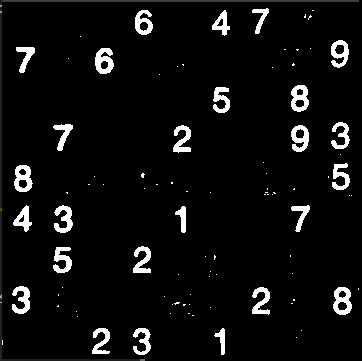
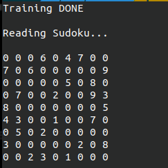
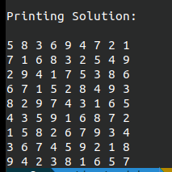

# SudokuSolver with Dancing Links

A Sudoku Solver made in C++ using the [OpenCV](https://opencv.org/) Interface to read and extract a sudoku from an image and solve it with [Knuth's Dancing Links technique](https://en.wikipedia.org/wiki/Dancing_Links) 
and [AlgorithmX](https://en.wikipedia.org/wiki/Knuth%27s_Algorithm_X).

## Getting Started

Make sure you have installed the [OpenCV](https://docs.opencv.org/4.3.0/df/d65/tutorial_table_of_content_introduction.html) library.

Then go the project folder and use CMake to create Makefile's :

```bash
cmake .
```

Finally compile the project with :

```bash
make
```

## Usage

```bash
./SudokuImage testPhotos/sudoku.jpg
```

## Example

Original Image:


Preprocess Image:



Train KNearest model and read digits:



Solve Sudoku with Algorithm X:


